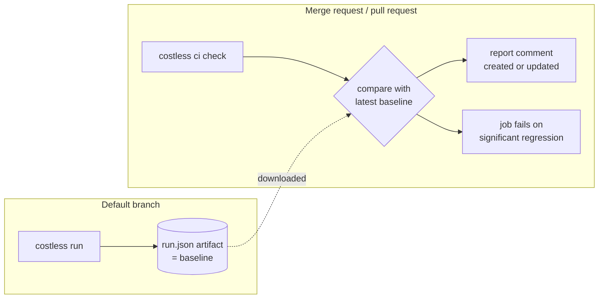

# CI integration

Both integrations follow the same flow:



- **On the default branch**, a job runs the eval and keeps `run.json` as an
  artifact. Only successful jobs count, so a broken run never becomes the baseline.
- **On every merge request or pull request**, `costless ci check` does five things:
  1. runs the eval
  2. downloads the latest baseline from the target branch
  3. compares the two runs (see [How gating works](statistics.md))
  4. writes `report.md` and `comparison.json`
  5. creates the report comment, or updates the one it posted earlier (it finds
     that comment by a hidden marker)

  The job exits 1 when the quality or budget gate fails, and 2 on configuration or
  CI errors. Failing to post the comment only produces a warning; the job status
  is what gates the merge.
- **When no baseline exists yet**, only absolute limits are checked. This is
  normal for the first merge request after enabling costless, and the report
  says so.

## GitLab (CI/CD component)

```yaml
# .gitlab-ci.yml
include:
  - component: $CI_SERVER_FQDN/<group>/costless/costless@<version>
    inputs:
      config: evals/costless.yaml
      install: pip install -e . "costless @ git+https://github.com/amine123456/costless.git@main"
```

| Input | Default | Meaning |
|---|---|---|
| `stage` | `test` | stage of both jobs |
| `config` | `costless.yaml` | path to the config |
| `image` | `python:3.12-slim` | job image |
| `install` | pip install from GitHub | installs costless and your application |
| `baseline_expire_in` | `90 days` | how long baselines are kept |
| `allow_failure` | `false` | report regressions without blocking |

The component defines two jobs:

| Job | Runs on | What it does |
|---|---|---|
| `costless-baseline` | default branch | runs the eval and stores the baseline artifact |
| `costless-check` | merge requests | runs `costless ci check` |

The baseline is fetched with the job-artifacts API: the latest successful
`costless-baseline` job on the MR's target branch.

**CI/CD variables** (masked, protected as appropriate):

- **The model provider's key:** `GEMINI_API_KEY`, `ANTHROPIC_API_KEY`, ...
- **`COSTLESS_GITLAB_TOKEN`:** a project access token with the `api` scope and the
  Reporter role. `CI_JOB_TOKEN` can download artifacts but cannot write MR notes.
  Without this token the job still gates, but no comment is posted.

To block merges on the result, enable **Pipelines must succeed** in the
project's merge request settings.

To use the component from this repository without the CI/CD catalog, include it
by project instead:

```yaml
include:
  - project: <group>/costless
    ref: main
    file: templates/costless.yml
    inputs:
      config: evals/costless.yaml
```

## GitHub Actions (reusable workflow)

```yaml
# .github/workflows/evals.yml
on:
  push:
    branches: [main]
  pull_request:

permissions:
  contents: read
  pull-requests: write   # post the report comment
  actions: read          # download the baseline artifact

jobs:
  costless:
    uses: amine123456/costless/.github/workflows/costless.yml@main
    with:
      config: evals/costless.yaml
      install: pip install -e . "costless @ git+https://github.com/amine123456/costless.git@main"
    secrets: inherit
```

| Input | Default | Meaning |
|---|---|---|
| `config` | `costless.yaml` | path to the config |
| `python-version` | `3.12` | Python used by the jobs |
| `install` | pip install from GitHub | installs costless and your application |
| `artifact-name` | `costless-baseline` | baseline artifact name |
| `continue-on-regression` | `false` | report regressions without failing |

The report also appears in the job summary, and the whole `.costless/`
directory is uploaded as an artifact.

To block merges, make the `costless / check` job a required status check in
the branch protection rules.

Pull requests from forks get no repository secrets and a read-only token. The
eval therefore cannot call a paid model there, and the comment cannot be posted.
This is GitHub's security model, not a costless limitation.

## Other CI systems

The building blocks are plain commands:

```bash
costless run -c costless.yaml -o baseline/run.json   # on the default branch; store as an artifact
costless compare -b baseline/run.json --candidate .costless/run.json \
    -c costless.yaml --markdown report.md            # on a merge request; exit 1 = regression
```
